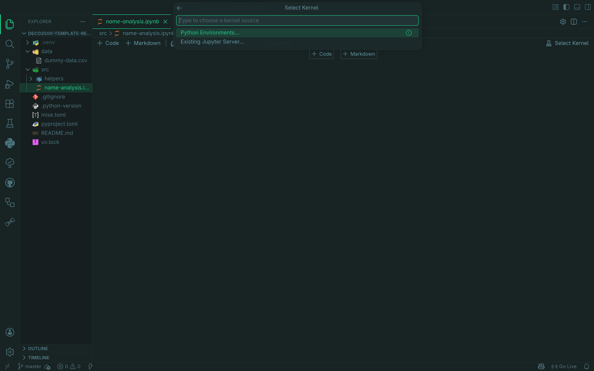
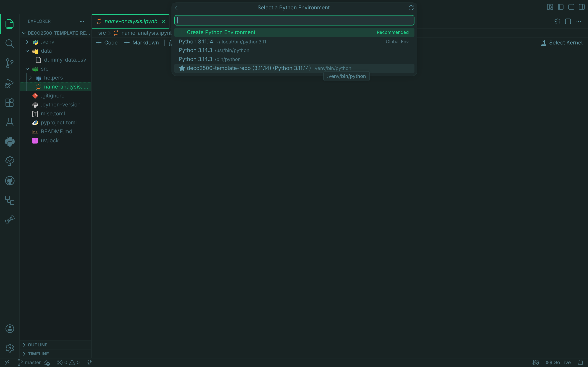
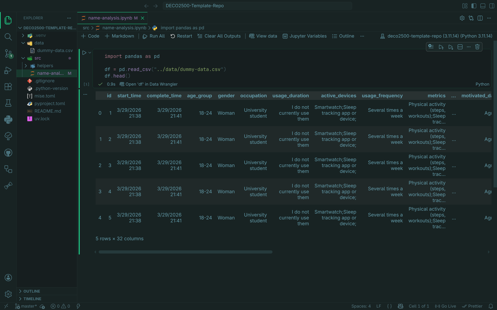

# DECO2500

Hi everyone. This repository is now available as a template repository. It
has been setup to include *most* of the packages required for quantitative
analysis.

The packages were mainly chosen from this [article](https://www.datacamp.com/blog/top-python-libraries-for-data-science)
as well as what we were able to tell was being used within Google Collab in the studios.

Namely, these packages are:

1. [Pandas](https://pandas.pydata.org/)
2. [Matplotlib](https://matplotlib.org/)
3. [Numpy](https://numpy.org/)
4. [Scipy](https://scipy.org/)

The project was setup using [uv](https://docs.astral.sh/uv/) for convenience
as it can setup a **virtual-environment** and installing our required
packages.

This project was also setup using [mise](https://mise.jdx.dev/). Installing
**mise** is optional but it can help set things up quicker.

## Setup (with mise)

If you have chosen to install **mise** or already have it installed then you
can get up and running with the following commands

Please see the [following](https://mise.jdx.dev/installing-mise.html) on how
to install **mise** for your OS.

After installing **mise** run the following commands in the project root:

```sh
mise trust # Tell mise to trust the mise.toml in project directory
mise install # Installs uv
uv sync # Sets up a .venv and installs deps & dev-deps
```

## Setup (no mise)

If you're not using **mise** and don't want to use it then you will need to
[manually install](https://docs.astral.sh/uv/getting-started/installation/#standalone-installer) **uv** for your OS.

After installing **uv** run the following commands in the project root:

```sh
uv sync # Sets up a .venv and installs deps & dev-deps
```

## Analysis

If you've finished setting up (with or without **mise**), you can get
started by creating a **Jupyter notebook** in the `src/` directory. For
consistency please name it: `<your_name>-analysis.ipynb`

Upon opening the notebook you'll need to choose a kernel:


Choose the **Python Environments** and select the **Virtual env** that
was created by **uv**:


You may be prompted to install a few things just choose to install it. Once
it finishes you should receive code-completion and a bunch of other benefits:


> [!WARNING]  
> The **dummy-data.csv** is **NOT** the survey data. Please refer to our cleant
> up survey data in the team drive.
11